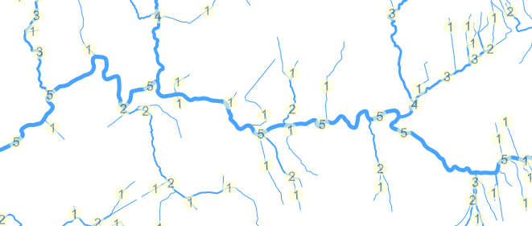

===============================
cascade
===============================

| |Version| |Coveralls|

A Python library to assign river order to hydrometric networks. Geospatial networks can be loaded
using https://github.com/compassinformatics/wayfarer/, and then stream ordering can be applied.

* Documentation: https://compassinformatics.github.io/cascade/

Features
--------

Two stream-ordering algorithms:

* Strahler
* Shreve

Usage
-----

.. code-block:: python

    import fiona
    from networkx import MultiDiGraph
    from wayfarer import loader
    from cascade import orderer

    # load a network from a shapefile
    recs = fiona.open("./docs/examples/HydroEdge11.shp", "r")
    net = loader.load_network_from_geometries(
        recs,
        key_field="SEG_CD",
        keep_geometry=True,
        use_integer_keys=False,
        graph_type=MultiDiGraph,
    )
    o = orderer.Orderer(code_field="SEG_CD")

    # assign orders to the network
    orders = o.assign_order(net)

    # loop through orders
    for seg_cd, values in orders.items():
        strahler_order, shreve_order = values[0], values[1]
        print(
            f"Segment Code: {seg_cd} Strahler Order: {strahler_order} Shreve Order: {shreve_order}"
        )

Installation
------------

.. code-block:: bash

    pip install cascade-rivers

.. |Version| image:: https://img.shields.io/pypi/v/cascade-rivers.svg
   :target: https://pypi.python.org/pypi/cascade-rivers

.. |Coveralls| image:: https://coveralls.io/repos/github/compassinformatics/cascade/badge.svg?branch=main
    :target: https://coveralls.io/github/compassinformatics/cascade?branch=main

.. |Downloads| image:: http://pepy.tech/badge/cascade-rivers
    :target: http://pepy.tech/project/cascade-rivers